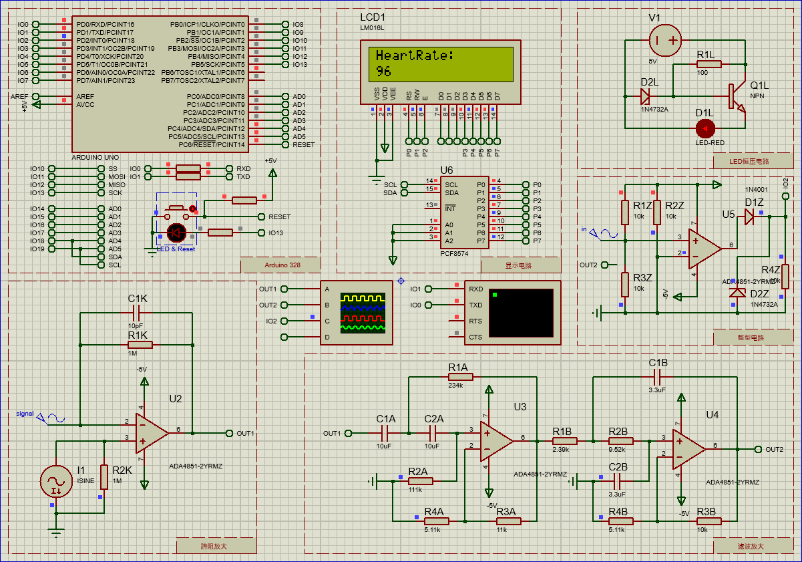

# HeartRate
> 调研报告：基于光电传感器技术的心率/脉率检测方法研究  

# 系统结构设计
通过光电二极管采集信号，再放大、滤波消除噪声。信号进入处理器进行数据的处理并计算，最后在显示屏上显示。 
将电路主要分为三个部分：1)信号调理电路；2)处理器与显示电路；3)电源电路。 
## 系统结构框图

## 程序流程图

# 元件清单
|元件清单|具体型号|
|:-----:|:-----:|
|激光二极管：|GH06510F4A|
|光电二极管：|SFH203P|
|传感器接口电路：|ADA4622-4|
|滤波放大整型：|ADA4622-4|
|微处理器：|Arduino UNO|
|显示：|LCD1602|
|I2C：|PCF8574|
# 参考
[Pulse sersor][sersor] 
[TINKERCAD][tinkercad] 
[基于摄像头的心率测量html文件][HTML] 
[Analog Devices滤波器设计][Analog Devices] 
[proteus仿真arduino中使用PCF8574以I2C方式操作LCD1602][xiHe] 
[Arduino中断][attachinterrupt] 
[手指检测心跳设计——传感器制作篇][shouZhi] 
[基于uFUN开发板的心率计（一）DMA方式获取传感器数据][wangchao1] 
[绿or红？心率监测使用哪种光比较好？][绿or红] 
[脉搏波速度(PWV)分析][脉搏波速度(PWV)分析] 
[典型四款直流稳压电路原理][典型四款直流稳压电路原理] 
[巴特沃斯滤波器设计][巴特沃斯滤波器设计] 

# F.1 测量仪器设计拓展
## F.1.1 一般结构
* **传感器：** 实现生理信号从非电量到电量的变换； 
* **传感器接口电路：** 将传感器输出信号转换成低输出电阻的电压信号； 
* **放大滤波器：** 获得纯净可识别信号； 
* **ADC：** 模拟/数字变换，得到数字信号； 
* **微处理器/微控制器：** 实现信号输出显示、存储、控制，以及改变电路参数。 

## F.1.2 设计原则
确定目标，总体框架，功能模块，具体技术，具体型号，参数选择。 
先从整体考虑，逐步精细化，直至达成目标。(自上而下) 
1. 被测量的量是什么？信号的大小与频率是多少？（心率，毫伏级水平，50~150次/min）； 
2. 输出是什么？如何与使用者传达信息？（通过显示屏输出）； 
3. 仪器的测量的精度、性能； 
4. 仪器的使用条件； 
5. 仪器的功能（测量心率）； 
6. ~~成本、工艺条件；~~ 

[HTML]:https://github.com/gfwilliams/HeartRate"
[PPG]:[https://www.cdstm.cn/gallery/media/mkjx/wxd/201605/t20160525_321684.html "光电容积法"
[sersor]:https://pulsesensor.com/ "光电传感器模块"
[tinkercad]:https://www.tinkercad.com/ "Arduino仿真"
[xiHe]:https://blog.csdn.net/haigear/article/details/88935697 "proteus仿真arduino中使用PCF8574以I2C方式操作LCD1602"
[shouZhi]:https://blog.csdn.net/qq_34445388/article/details/79781181/ "手指检测心跳设计——传感器制作篇"
[wangchao1]:http://www.wangchaochao.top/2019/03/23/uFun-3/ "基于uFUN开发板的心率计（一）DMA方式获取传感器数据"
[wangchao2]:http://www.wangchaochao.top/2019/03/31/uFun-5/ "基于uFUN开发板的心率计（二）动态阈值算法获取心率值"
[wangchao3]:http://www.wangchaochao.top/2019/04/05/uFun-6/ "基于uFUN开发板的心率计（三）Qt上位机的实现"
[attachinterrupt]:https://www.arduino.cc/reference/en/language/functions/external-interrupts/attachinterrupt/ "attachinterrupt"
[Analog Devices]:https://www.analog.com/cn/design-center/design-tools-and-calculators.html
[绿or红]:https://zhuanlan.zhihu.com/p/29314838
[脉搏波速度(PWV)分析]:http://www.vital-scan.cn/dtr_pwv_overview_cn.htm
[典型四款直流稳压电路原理]:https://www.eefocus.com/analog-power/411020
[巴特沃斯滤波器设计]:http://www.tastones.com/tutorial/filters/butterworth-filters/
