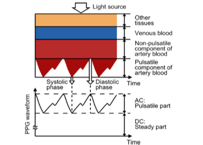
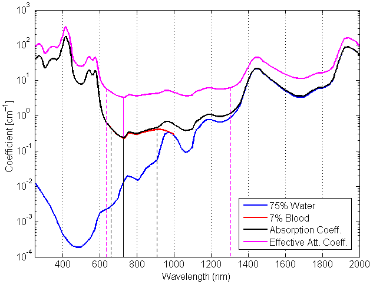
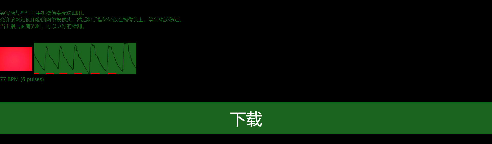
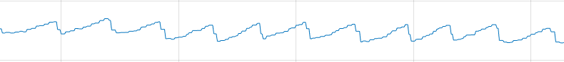

# HeartRate
> 调研报告：基于光电传感器技术的心率/脉率检测方法研究  

常见的可穿戴光电容积法传感器有两种模式——透射模式和反射模式。如图所示。因为本次实无硬件电路实现来进行信号的测量，所以在发光二极管以及后续的信号调理电路中的放大倍数均要进行考虑计算。对于透射已经有非常完善的定律（朗伯-比尔定律），其在超声、X射线等临床领域已经是非常完善的理论基础之一了。所以采用了透视模式来计算。 
  
在LED的光源的波长选择方面，由于目前只有光电心率传感器MAX30102的发光的二极管，其集成了两个发光二极管，一个是红光LED(660nm)，另一个是红外光LED(880nm)，在仅仅测量心率的时候仅红光LED工作，这样我就可以对660nm的红光进行实验。所以我将要选择的发光二极管波长为660nm。 
# 1 原理
## 1.1 光电二极管 - 光电导模式
这时二极管上施加反向电压（即在该方向的电压下如果不存在入射光的情况下二极管是不导电的），这一模式响应速度快，但是它会引发更大的信号噪声。同时，耗尽层的宽度增加，从而降低了结电容，同样使得响应时间减少。反向偏置会造成微量的电流（饱和电流），这一电流与光电流同向。对于指定的光谱分布，光电流与入射光照度之间呈线性比例关系。 
光电二极管的一些关键性能参数包括：响应率、暗电流、响应率、等效噪声功率。 
## 1.2 光电容积法
[光电容积法(PPG)][PPG]是一种简单且价格低廉的光学技术，可以探测微血管的血液体积变化，进而测量心率，具有方法简单、佩戴方便、可靠性高等特点。 
本次实验的信号采集部位选择了手指，人的手指组织可分为肌肉、骨骼、血液、脂肪等,对于肌肉骨骼等组织其体积不会产生明显的变化，并且血液中的静脉也不会产生明显的变化。我们所测的信号主要来自血液中的动脉血容量的变化。动脉在心脏周期的收缩期比舒张期含有更多的血容量。所以动脉血提供给我们交流电(AC)；而另外的组织提供了直流电(DC)成份。注意：直流成份也不是一味的“直流”，其成份也会随呼吸产生周期的微小的变化。 
 
## 1.3 朗伯-比尔定律（Lambert-Beer Law）
一束单色光照射于一吸收介质表面，在通过一定厚度的介质后，由于介质吸收了一部分光能，透射光的强度就要减弱。吸收介质的浓度愈大、介质的厚度愈大，则光强度的减弱愈显著，其关系为： 
 $$A = -\log_{10}\frac{I_t}{I_0} = \log_{10}\frac{1}{T} = K\cdot l\cdot c$$  
$A$:吸光度；$I_0$：入射光强度；$I_t$：透射光强度；$T$：透射比；$K$：系数(吸收系数or摩尔吸收系数)；$l\ (cm)$：吸收介质的厚度；$c\ (g/L\ or\ mol/L)$：吸光物质的浓度。 
+ 当介质厚度$l$以$cm$为单位，吸光物质浓度$c$以$g/L$为单位时，$K$用$a$表示，称为吸收系数，其单位为$L/g·cm$。这时朗伯-比尔定律表示为$A=a·l·c$。 
+ 当介质厚度$l$以$cm$为单位，吸光物质浓度$c$以$mol/L$为单位时，$K$用$ε$表示，称为摩尔吸收系数，其单位为$L/mol·cm$。这时朗伯-比尔定律表示为$A=ε·l·c$。 
由上面的描述我们可以推导公式并简化得到： 
 $$I_t = I_0 e^{-\mu_el} , \mu_e=K\cdot c$$  
$\mu_e$为有效衰减系数($cm^{-1}$)。由于光与生物组织的相互作用非常复杂不止有吸收，还有散射、反射等作用，所以使用等效的衰减系数来代替其原本的吸收系数。Anderson和Parrish研究了光在人皮肤中的光学特性人体皮肤的模型建立。介质和光线能量的不同其等效衰减系数也会不同。如下图粉线为乳房组织在不同波长光照下的有效衰减系数($cm^{-1}$)，取倒数即为该光线在乳房组织的穿透深度($cm$). 
  
有效衰减系数最小值点$\lambda _{min} = 730 nm$; 光学窗口$ = (626 - 1316) nm$。采用了动脉血和静脉血之比为2:8的经典比例。在660nm的波长其有效衰减系数$\mu_e = 4.5cm^{-1}$.  
# 2 光电容积法下光照强度变化的理论分析
所以在本次实验中将手指建模，根据人食指指腹适当按压后其上下距离，模型化成一个厚度为1cm的介质。假设入射光与透射光均为平行光，入射光辐射强度$I_0$；透射光辐射强度$I_t$，两个单位均为($W/m^2$)。 
对于测量手指的有效衰减系数，本次实验采用波长660nm(650nm~670nm)、辐射功率9.8mW的光源作为采集光。使用电脑的摄像头作为信号接收区。发射设备与接受设备之间留有手指正好放入的空间(1cm)，在黑暗（无环境光或弱环境光）的环境下分别检测三个数据：1.没有光照下的信号；2.仅660nm光照下的信号；3.手指放入检测的数据。数据的采集以及下载将使用[HeartRate.html](web/HeartRate.html "测量心率")文件.
   
**发射与接受设备的距离以及相对位置：** 选择一本较厚的书，选择与封面距离为1cm的页码将手机夹入，使得手机平行于书本平行于电脑如下图1所示。再通过电脑的摄像头取得的画面可以非常好的判断发光二极管是否与接收设备对齐。 
   
  
 上图B为测量时的画面，数据共测量了三次。注意：测量准备并不开手机本身的照明LED；准备以及测量时均在黑暗的环境下进行。 
  
**记录实验结果并计算：** 根据实验数据,选择出现周期波动的时间段。对三组数据的可用波形，随机选择波峰和波谷（成对）。计算出波峰的平均值为65.8983，波谷的平均值为65.3691.虽然这两个数据本身并没有明确的意义，但是可以计算出动脉血溶剂变化时的等效衰减系数差。 
$$\Delta \mu _e = \ln \frac{65.3691}{65.8983} = -0.0035$$ 
# 器件选型与比较
## 发光二极管选择
### 绿光
**优势：** 信号幅度大；环境光影响小。**劣势：** 肤色纹身影响小、穿透深度浅、易实现。 
### 红光
与绿光正好相反，虽然不易实现真实的电路但是依旧选择它理由有三：1. 无硬件电路实现，可不考虑不同波长光照的劣势，随之带来的是复杂的计算，透射式可以更方便的计算；2. 采用透射式的光电采集心率，对于绿光可能不会透过手指，而用红光透射手指可以使用更小功耗的LED；3. 红光采集受的环境光的影响方式大，可以采取戴指套隔绝环境光亦或者使用两片环境光传感器利用差分放大来消除环境光的影响。 
根据上述理论我们需要的发光二极管的光照需要穿透深度大、波长范围窄、近似于平行光等特点。所以选择激光二极管是再好不过了。通过和光电二极管比较计算，最终选择了GH06510F4A，其光输出功率7mW(能穿过手指)，波长范围窄660±6nm，半强度角小(接近平行)，工作温度宽，低功耗。 
## 光电二极管及传感器接口电路选择
### 方案1 - OPT101
OPT是集成化的光电二极管加上传感器接口电路(跨阻放大器)，其集成化度高，但是同时光电管无法更换，并且其在运放的同相端有7.5mV的电压。 
### 方案2 - SFH203P+ADA4622
SFH203P虽然最敏感的波长是850nm，但是它在660nm的灵敏度也有最高的80%，并且它的噪声低0.029pW/√Hz。 
ADA4622非常适合光电二极管前置放大器应用。其低输入偏置电流可降低前置放大器输出的直流误差。此外，其高增益带宽积和低输入电容可最大化光电二极管前置放大器的信号带宽。 
## 滤波放大器选择
### ADA4622
是AD820/AD822的下一代产品。带宽和压摆率得到提高，输出驱动增强，电压噪声更低；在保证电流电源与AD822相同的前提下，宽带噪声降低25%，1/f噪声降低一半。相比AD822直流精度有改善，失调降低一半，并且ADA4622增加了最大温漂的规格。共模抑制比(CMRR)优于上一代，使得ADA4622更适合用于同相增益和差动放大器配置。与传感器接口电路可以集成在一片芯片中，集成度更高。 
## 核心处理器选择
### 方案1 - 80C51
80C51有两个16位定时计数器，两个外中断，两个定时计数中断，及一个串行中断，并有4个8位并行输入口。80C51内部有时钟电路，但需要石英晶体和微调电容外接。具备了便宜、电路简单、体积小与耗电低等优点。 
### 方案2 - Arduino UNO
Arduino Uno开发板——以ATmega328 MCU控制器为基础——具备14路数字输入/输出引脚(其中6路可用于PWM输出)、6路模拟输入、一个16MHz陶瓷谐振器、一个USB接口、一个电源插座、一个ICSP接头和一个复位按钮。它采用Atmega16U2芯片进行USB到串行数据的转换。 
由于Arduino IDE程序有非常多的函数和头文件的资源可以调用，又因为在本次实验中不需要硬件电路的搭建，故选择Arduino UNO作为本次实验的处理器。 
|元件清单|具体型号|
|:-----:|:-----:|
|激光二极管：|GH06510F4A|
|环境光传感器：|SFH203P|
|传感器接口电路：|ADA4622|
|滤波放大电路：|ADA4622|
|微处理器：|Arduino UNO|
|显示：|LCD1602|
|IIC：|PCF8574|
# 2 系统结构设计
通过光电二极管采集信号，再放大、滤波消除噪声。信号进入处理器进行数据的处理并计算，最后在显示屏上显示。 
将电路主要分为三个部分：1)信号调理电路；2)处理器与显示电路；3)电源电路。 
## 系统结构框图

## 模块设计
### 信号调理电路
> 负责信号的采集、放大、滤波 
#### 信号采集与电流电压转换
1. 选择增益电阻。 
$$R_1 = \frac{V_{oMAX}-V_{oMIN}}{I_{iMAX}} = \frac{0.5V-0V}{0.5\mu A} = 1M\Omega $$
2. 选择满足电路带宽要求的反馈电容。 
$$C_1 ≤ \frac{1}{2\pi R_1 f_p} = \frac{1}{2\pi\times 1M\Omega \times 10KHz} ≤ 15.92pF\approx 16pF$$
3. 计算使电路保持稳定所必需的运算放大器增益带宽(GBW) 

#### 带通滤波器
0.1Hz~10Hz
#### 二级放大
### 处理器与显示电路
> 负责信号的处理、计算、显示 
### 电源电路
> 负责整体电路的稳定供电 
### 其它电路
#### 发光电路
由于需要稳定的光源，所以发光二极管需要稳压。 
## 软件设计

# 参考
1. [Pulse sersor][sersor] 
2. [TINKERCAD][tinkercad] 
3. [proteus仿真arduino中使用PCF8574以I2C方式操作LCD1602][xiHe] 
4. [手指检测心跳设计——传感器制作篇][shouZhi] 
5. [基于uFUN开发板的心率计（一）DMA方式获取传感器数据][wangchao1] 

# F.1 测量仪器设计拓展
## F.1.1 一般结构
* **传感器：** 实现生理信号从非电量到电量的变换； 
* **传感器接口电路：** 将传感器输出信号转换成低输出电阻的电压信号； 
* **放大滤波器：** 获得纯净可识别信号； 
* **ADC：** 模拟/数字变换，得到数字信号； 
* **微处理器/微控制器：** 实现信号输出显示、存储、控制，以及改变电路参数。 

## F.1.2 设计原则
确定目标，总体框架，功能模块，具体技术，具体型号，参数选择。 
先从整体考虑，逐步精细化，直至达成目标。(自上而下) 
1. 被测量的量是什么？信号的大小与频率是多少？（心率，毫伏级水平，60~100次/min）； 
2. 输出是什么？如何与使用者传达信息？（通过显示屏输出）； 
3. 仪器的测量的精度、性能； 
4. 仪器的使用条件； 
5. 仪器的功能（测量心率）； 
6. ~~成本、工艺条件；~~ 

[photodiode]:"https://zh.wikipedia.org/wiki/%E5%85%89%E7%94%B5%E4%BA%8C%E6%9E%81%E7%AE%A1 "光电二极管"
[PPG]:https://www.cdstm.cn/gallery/media/mkjx/wxd/201605/t20160525_321684.html "光电容积法"
[sersor]:https://pulsesensor.com/ "光电传感器模块"
[tinkercad]:https://www.tinkercad.com/ "Arduino仿真"
[xiHe]:https://blog.csdn.net/haigear/article/details/88935697 "proteus仿真arduino中使用PCF8574以I2C方式操作LCD1602"
[shouZhi]:https://blog.csdn.net/qq_34445388/article/details/79781181/ "手指检测心跳设计——传感器制作篇"
[wangchao1]:http://www.wangchaochao.top/2019/03/23/uFun-3/ "基于uFUN开发板的心率计（一）DMA方式获取传感器数据"
[wangchao2]:http://www.wangchaochao.top/2019/03/31/uFun-5/ "基于uFUN开发板的心率计（二）动态阈值算法获取心率值"
[wangchao3]:http://www.wangchaochao.top/2019/04/05/uFun-6/ "基于uFUN开发板的心率计（三）Qt上位机的实现"
[attachinterrupt]:https://www.arduino.cc/reference/en/language/functions/external-interrupts/attachinterrupt/ "attachinterrupt"